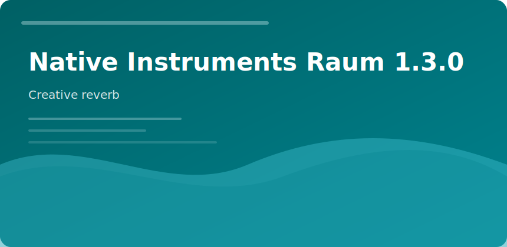

  

  

## Native Instruments Raum 1.3.0

Compact UI, three reverb engines, modulation for movement without washing transients.

### Engines

1. **Grounded** — room/plate hybrids
2. **Airy** — long tails for ambient beds
3. **Cosmic** — shimmer and pitch-shifted reflections

### Mix table

| Source | Starting point |
|--------|----------------|
| Vocals | Send 15%, short predelay |
| Drums | Room mode, low wet |
| Synths | Cosmic, automate decay |

v1.3.0 adds smoother modulation routing and CPU tweaks for low-latency tracking sessions.

native instruments raum reverb vst plugin mixing effects
